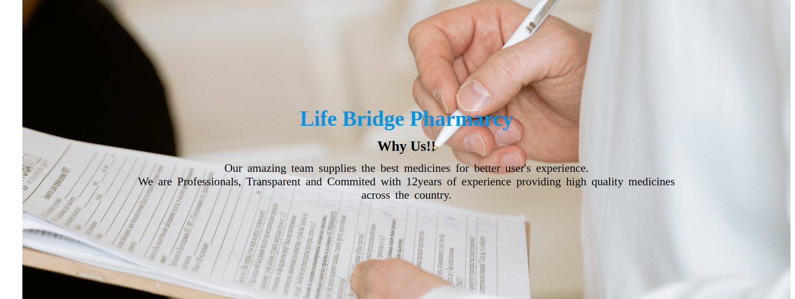
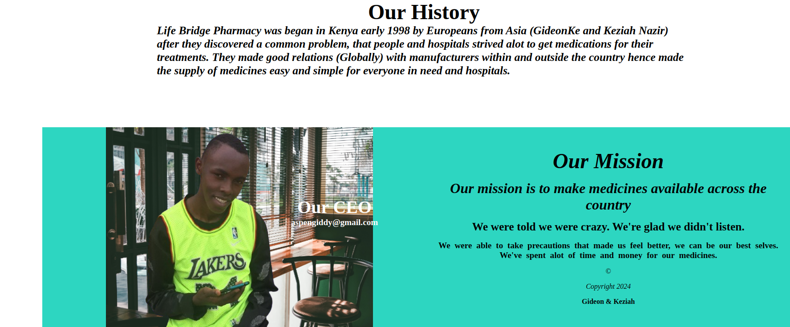

# Life Bridge Pharmacy

---

## project description

---

## To access the project use this

[link](https://github.com/KeziahNasir/Lifebridge-pharmarcy.git)

Life bridge is a pharmacy that helps in distribution of medicine across the country.

## screenshots

This how the project looks like!!

## Technologies type

- html5
- css

  ## Project installation and project set ups

  1. open the terminal and navigate to where you want to store the project eg. `cd Desktop``
  2. To clone the git hub pages paste this on the terminal https://github.com/KeziahNasir/Lifebridge-pharmarcy.git
  3. Use `cd LifeBridge pharmarcy` to get to the project directory
  4. Run the project

## Contact

If you would like to get in touch for more information, feedback, queries any additional terms reach us on **gideonkitheka15@gmail.com**
whatsapp us on **+254 705764291**

## license

Copyright (c) [2024] [***GideonKe***]

Permission is hereby granted, free of charge, to any person obtaining a copy
of this software and associated documentation files (the "Software"), to deal
in the Software without restriction, including without limitation the rights
to use, copy, modify, merge, publish, distribute, sublicense, and/or sell
copies of the Software, and to permit persons to whom the Software is
furnished to do so, subject to the following conditions:

The above copyright notice and this permission notice shall be included in all
copies or substantial portions of the Software.

THE SOFTWARE IS PROVIDED "AS IS", WITHOUT WARRANTY OF ANY KIND, EXPRESS OR
IMPLIED, INCLUDING BUT NOT LIMITED TO THE WARRANTIES OF MERCHANTABILITY,
FITNESS FOR A PARTICULAR PURPOSE AND NONINFRINGEMENT. IN NO EVENT SHALL THE
AUTHORS OR COPYRIGHT HOLDERS BE LIABLE FOR ANY CLAIM, DAMAGES OR OTHER
LIABILITY, WHETHER IN AN ACTION OF CONTRACT, TORT OR OTHERWISE, ARISING FROM,
OUT OF OR IN CONNECTION WITH THE SOFTWARE OR THE USE OR OTHER DEALINGS IN THE
SOFTWARE.
